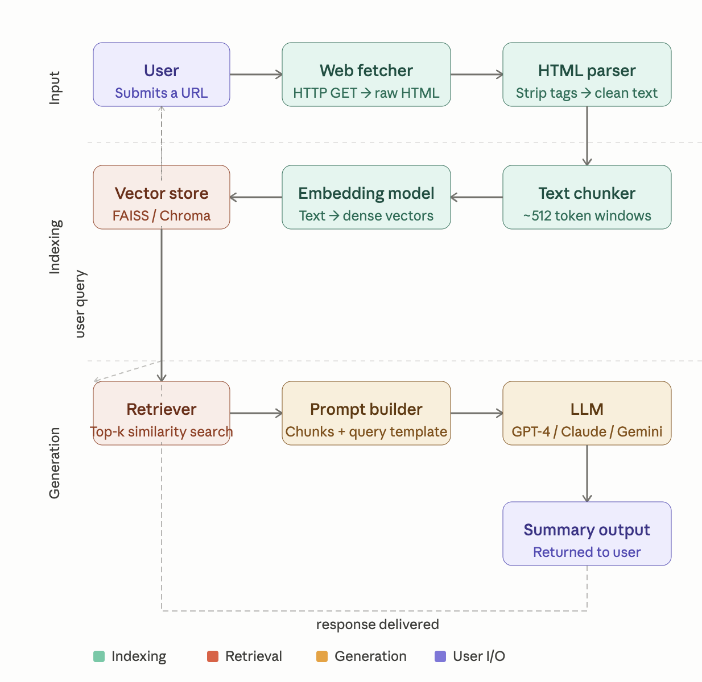

# Assignment 2 — 2-Stage RAG Workflow with Vector DB

## Overview

This project implements a **Retrieval-Augmented Generation (RAG)** pipeline that takes a URL as input, ingests and indexes the web page content into a Vector Database, and then answers follow-up questions using semantic similarity search + an LLM.

---

## Architectural Diagram



---

## Architecture — 2-Stage Pipeline

### Stage 1 — Ingest & Index *(runs on URL submission)*

```
User submits URL
      ↓
[Web Fetcher] — HTTP GET to fetch raw HTML
      ↓
[HTML Parser] — Strip tags, extract clean body text
      ↓
[Chunker] — Split text into ~500 token overlapping chunks
      ↓
[Embedding Model] — Convert each chunk → dense vector (e.g. OpenAI / HuggingFace)
      ↓
[Vector DB] — Upsert chunk embeddings + metadata (source URL, chunk index)
      ↓
[LLM Summarizer] — Summarize all chunks → concise page summary
      ↓
Display summary to user
```

### Stage 2 — Query & Answer *(runs on each follow-up question)*

```
User asks a question
      ↓
[Embedding Model] — Embed the query into a dense vector
      ↓
[Vector DB] — Similarity search → retrieve top-k relevant chunks
      ↓
[Context Builder] — Assemble retrieved chunks into a context window
      ↓
[LLM Answer Generator] — (question + context) → grounded answer
      ↓
Display answer to user
```

---

## How to Proceed — Step-by-Step Plan

### Step 1 — Environment Setup

- Create a Python virtual environment and activate it.
- Install required libraries: `requests`, `beautifulsoup4`, `openai`, `chromadb`, `tiktoken`, `python-dotenv`.
- Create a `.env` file and add your `OPENAI_API_KEY`.

---

### Step 2 — Web Fetcher & HTML Parser

- Send an HTTP GET request to the submitted URL.
- Parse the raw HTML using BeautifulSoup.
- Remove unwanted tags (scripts, styles, nav, footer).
- Extract and return clean plain text from the page body.

---

### Step 3 — Chunker

- Tokenize the extracted text using a tokenizer (e.g. `tiktoken`).
- Split into chunks of ~500 tokens with a 50-token overlap.
- Overlap prevents loss of context at chunk boundaries.

---

### Step 4 — Embedding Model + Vector DB

- Pass each chunk through an embedding model (e.g. `text-embedding-3-small`) to get dense vectors.
- Upsert each vector along with its source text and metadata (URL, chunk index) into ChromaDB or Pinecone.

---

### Step 5 — LLM Summarizer

- Take the first N chunks of the ingested page.
- Send them to an LLM (e.g. `gpt-4o-mini`) with a summarization prompt.
- Display the resulting summary to the user.

---

### Step 6 — Query Handler (Stage 2)

- Embed the user's question using the same embedding model.
- Run a similarity search in the Vector DB to fetch the top-k most relevant chunks.
- Assemble those chunks into a context window and send to the LLM with the question.
- Display the grounded answer to the user.

---

### Step 7 — Orchestrate & Run

- Wire all steps together in a main script.
- On startup: accept a URL → run Stage 1 (ingest + summarize).
- In a loop: accept questions → run Stage 2 (search + answer).
- Exit when the user types `exit`.

---

## Vector DB Options

| Feature     | ChromaDB              | Pinecone              |
|-------------|-----------------------|-----------------------|
| Hosting     | Local / in-memory     | Cloud (managed)       |
| Setup       | pip install, zero config | API key required   |
| Persistence | Optional (disk)       | Always persistent     |
| Best for    | Prototyping / local   | Production / scale    |
| Cost        | Free                  | Free tier available   |

---

## Key Design Decisions

- **Chunk size ~500 tokens** — balances context richness vs. retrieval precision.
- **Overlap of 50 tokens** — prevents answer loss at chunk boundaries.
- **`text-embedding-3-small`** — cost-efficient with strong semantic quality.
- **Top-k = 5** — retrieves enough context without overwhelming the LLM prompt.
- **ChromaDB for dev, Pinecone for prod** — easy to swap by changing the vector store module.
